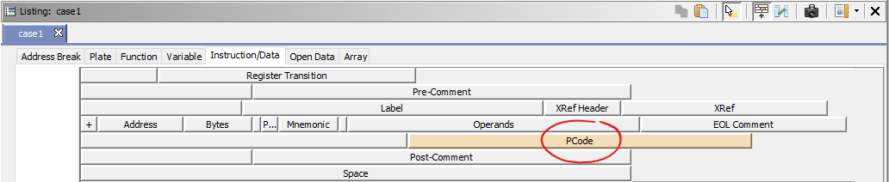
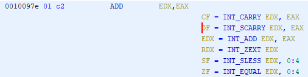
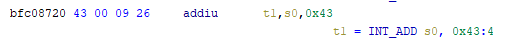
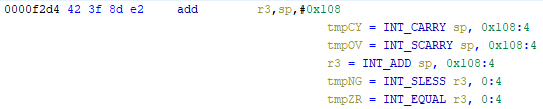
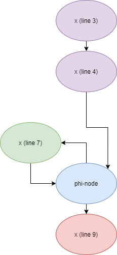
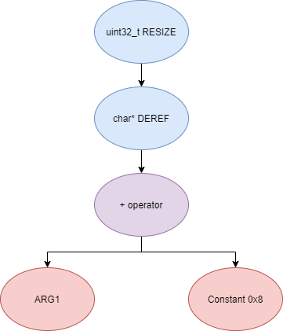
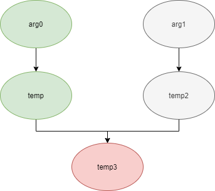

\
Over the course of my internship, I worked on projects that mainly involve binary analysis. One of these projects uses Ghidra to develop a plugin that automates struct identification of function parameters. The main idea behind my approach is to use static analysis to symbolically interpret Ghidra's P-Code representation of binaries. Every data value will be represented in relation to a function's arguments. By obtaining a list of store and load instructions performed on data offset from a function's arguments, we can infer the members and member sizes of the argument's struct.

This post will discuss in detail the techniques used, the background behind each technique, and the implementation.

<!-- more -->

# Background

Ghidra is a binary reverse engineering tool developed by the National Security Agency (NSA). Binary reverse engineering is the process of understanding the behavior of compiled binary code. To aid reverse engineers, Ghidra is a disassembler and decompiler that is able to recover high level C-like representation pseudocode from assembly, allowing reverse engineers to understand code much more easily. Ghidra also supports decompilation for over 16 architectures, which is an edge for Ghidra compared to its main competitor, IDA Pro Hex-Rays. A few examples of these architectures are: x86, x86-64, MIPS, and ARM.

One great feature about Ghidra is its [API](https://ghidra.re/ghidra_docs/api/index.html). Almost everything Ghidra does in the backend is accessible through Ghidra's API. Additionally, the documentation is well done, allowing me to easily understand the functions available through the API.

# Techniques

My approach involves performing static symbolic analysis on the data dependency graph from Ghidra's Intermediate Language (IL) representation of all architectures. As a result, this plugin supports all architectures supported by Ghidra, and new architectures can be supported by implementing a lifter to lift the desired architecture into Ghidra's IL, which also known as P-Code.

## Symbolic Analysis

Symbolic analysis has recently become popular, and a few symbolic analysis engines exist, such as [angr](http://angr.io/api-doc/index.html). The main idea behind symbolic analysis is execute the program while treating each unknown as a variable. Usually these unknowns are the inputs to the program or function. Then, any values derived from that value will be a symbolic expression, rather than a concrete value. Let's look at an example.

```c
int val1 = get_integer();
int val2 = val1 * 5;
int val3 = val2 + 1337;
```

In this pseudocode, the only unknown input is `val1`. This value is stored symbolically. So, when the second line is executed, the value stored in `val2` will be `val1 * 5`. Similarly the symbolic expressions continue the propagate, and `val3` will be `val1 * 5 + 1337`.

One major issue with symbolic execution is the path explosion problem. This occurs when a branch in the code is hit. Because symbolic execution seeks to explore the entire program, both paths from the branch will be taken, and the condition (and its inverse) for that branch will be imposed on both states after the branch. This is sound in theory, however many issues arise when you upscale the size of the program. Each conditional that is introduced will exponentially increase the possible paths that can be taken in the code. Storing symbolic state then presents a storage resource constraint, and analysis presents a time resource constraint.

## Intermediate Language

Often times, we like to find the similarities in many different ideas, and abstract them into one, for ease of understanding. This is precisely the idea behind intermediate languages. Because there exists numerous architectures out there - x86, ARM, MIPS, others - it isn't ideal to deal with each type individually. An intermediate language representation is created to be able to support and generalize many different architectures. Each architecture can then be transformed into this intermediate language and be treated as one problem.

Ghidra's intermediate language is called P-Code. Every single instruction in P-Code is well documented [here](https://ghidra.re/courses/languages/html/pcoderef.html) and [here](https://ghidra.re/courses/languages/html/additionalpcode.html). Ghidra's disassembly interface has an option to enable the P-Code representation of instructions, and can be found here:



To give an idea of what P-Code looks like, here are a few examples of instructions from different architectures and their respective P-Code representation.

x86 `add` instruction:



MIPS `addiu` instruction:



ARM `add` instruction:



With the basic set of instructions defined by P-Code specifications, all of the instructions from various architectures can be accurately modeled.

## Data Dependency

Data dependency is a useful abstract idea for representing code. The idea is that each instruction changes some sort of state in the program, whether it is a register, some stack variable, or memory on the heap. This changed state may then be used elsewhere in the program, often in the next few instructions. We say that whenever the state affected by instruction A is used by another state B that is affected by some instruction, then B depends on A. Thus, there is a directed edge from A to B. The combination of all such dependencies in a program is the data dependency graph.

Obtaining the data dependency graph of the assembly representation is more complicated since each architecture has different register models. First, we have to understand how Ghidra handles data dependency.

Ghidra's implementation of a data dependency graph uses P-Code representation. Ghidra represents each "state" (register, variable, or memory), as a node in the graph called a [Varnode](https://ghidra.re/ghidra_docs/api/ghidra/program/model/pcode/Varnode.html). The children of a node can be fetched with `getDescendants()`, and the parent of a node with `getDef()`. You might be wondering why the parent is singular - that is why does each node only ever have one parent. It makes sense that multiple values may affect another value. However this is because Ghidra uses [SSA](https://en.wikipedia.org/wiki/Static_single_assignment_form) (single static assignment) form, and Varnodes are chained together through P-Code instructions rather than Varnode edges.

SSA representation is a well studied idea in compiler theory. This is best demonstrated through an example. Let's use the following example:

```c
int x = 0; // x1
x = x + 3; // x2
while (x < 1337) { // x4
	x++; // x3
}
```

There are a few things to note here. First, take a look at lines 1 and 2. Intuitively we may think that it is reasonable for x to only be a single node here that gets assigned values twice. However, SSA requires each node to be assigned a value once. Therefore, according to SSA, we create different "versions" of x each time it gets assigned a new value. Hence the comments denoting different x's. In Ghidra terminology, there would be two `Varnodes` on lines 1 and 2.

The second thing to note is on line 3. Say we are looking at the loop condition `x < 1337`. Which Varnode is the x here derived from? There are actually two Varnode possibilities in this case - the `x` on line `2` and the `x` on line `4`. Both of these nodes are the parent of the `x` in the loop condition. In this case, SSA defines what is called a `phi node`, which represents the merging of multiple nodes. Ghidra defines this as a `multiequal` instruction, whose definition can be found [here](https://ghidra.re/courses/languages/html/additionalpcode.html). The x86-64 assembly of this example is shown below, with comments representing different "versions" of x.

```c
push    rbp
mov     rbp, rsp
mov     [rbp+x], 0 // x1
add     [rbp+x], 3 // x2
jmp     condition
loop:
add     [rbp+x], 1 // x3
condition:
cmp     [rbp+x], 538h // x4
jle     loop
mov     eax, 0
pop     rbp
retn
```

The respective data dependency graph would look like:



# Implementation

Using a combination of these techniques, we can identify the structs of function parameters. My method drew inspiration from [Value Set Analysis](https://research.cs.wisc.edu/wpis/papers/cc04.pdf), and there is actually a similar implementation written by [penhoi](https://github.com/penhoi/ghidra-decompiler/wiki/Symbolic-Value-Set-Analysis) using Ghidra for analyzing x86-64 binaries. The main idea is that for us to infer the members of a struct, some store and load will be performed at some offset on the struct pointer. To infer the size of the member, either the size of the load/store can be used (byte, word, dword, qword), or if two contiguous members are accessed, we know to draw a boundary between the two accessed members. I chose to implement the Ghidra plugin in Python, which is run through Ghidra's Jython interpreter.

To implement this, symbolic execution can be performed on the data dependency nodes whose root nodes are the function parameters. The data dependency graph can then be traversed with Depth-First Search (DFS), and all stores and loads performed are recorded. Conveniently, all stores and loads in any architecture are abstractized into the `STORE` and `LOAD` P-Code instructions.

## P-Code Function Depth-First Search

Because we are analyzing function parameters, we can consider functions to be isolated from each other. One issue you may be thinking about is the few globally shared structs that are used between functions. However, these cases are rare and much more difficult to accommodate for, as analysis will have to be performed on the entire program, so our initial implementation we considers this out of scope.

To access the varnodes of a function, Ghidra defines a `HighFunction` class that abstractizes a function into P-Code representation. Function parameter varnodes can then be fetched from here. Additionally, the data dependency graph for which we want to do DFS is easy to traverse with the `getDescendants()` function from `Varnode`. The DFS looks something like this:

```python
def traverseForward(cur, depth, pci, visited):
	if cur is None:
		return
	children = cur.getDescendants()
	for child in children:
		pci.process(child, depth)
		if child.getOutput() is not None and child.getOutput() not in visited:
			visited.add(child.getOutput())
			traverseForward(child.getOutput(), depth + 1, pci, visited)
```

Using this, we can traverse each P-Code instruction.

## P-Code Symbolic Execution

Now, we have to implement the actual symbolic execution. This involves writing a P-Code interpreter for each P-Code instruction, and storing the abstract symbolic expressions, with the symbolic variables being function parameters. The code for this is implemented in the `PCodeInterpreter` class, most of which is self explanatory. Symbolic expressions are stored in a tree structure, which is defined by the `Node` class. Let's take an example of a symbolic expression and look at how this would be stored.

```c
(uint32_t)(*((char*)(ARG1 + 0x8)))
```

In this case, the expression would be stored as:



Really, it's just a variant of a [binary expression tree](https://en.wikipedia.org/wiki/Binary_expression_tree).

Now let's look at the P-Code interpreter. Take the `INT_ADD` opcode as an example:

```python
def int_add(self, inputs, output):
	assert len(inputs) == 2 and output is not None
	a = inputs[0]
	b = inputs[1]
	if (a.isConstant() and b.isConstant()) or a.isConstant():
		raise Exception("INT_ADD error")
	for i in self.lookup_node(a):
		for j in self.lookup_node(b):
			self.store_node(output, i.add(j))
```

The implementation of most P-Code opcodes are simple to understand. In the `INT_ADD` case, there are two parameters, and parameter one is usually a `Varnode`, and parameter two might be a constant or `Varnode` added to parameter one. Most of the P-Code opcodes are implemented in a similar manner. You may wonder why the code loops through `a` and `b`. This is because there can be multiple paths in the code, resulting in multiple possible values, due to phi-nodes. Thus, each possibility and combination must be considered as a possible value a `Varnode` holds.

There are a few functions relevant to P-Code interpretation that require heavy consideration: `lookup_node`, `store_node`, and the `CALL` opcode. The first two functions respectively handle the mapping between Ghidra's `Varnodes` and the `Node` symbolic expression tree representation. The `CALL` opcode handles the interprocedural analysis.

## Mapping Varnodes to Symbolic Expressions

First, let's take a look at `store_node`:

```python
def store_node(self, varnode, nodeobj):
	if varnode not in self.nodes:
		self.nodes[varnode] = []
	if hash(nodeobj) not in map(hash, self.nodes[varnode]):
		self.nodes[varnode].append(nodeobj)
```

This is rather simple to understand, but is required for understanding `lookup_node`. Essentially, the `self.nodes` dictionary stores a mapping between a Ghidra `Varnode` object and a symbolic expression `Node` object. Now here is `lookup_node`:

```python
def lookup_node(self, varnode):
	# Detect cycle
	if varnode in self.cycle_exec:
		self.cycle_exec[varnode] += 1
	if varnode in self.cycle_exec and self.cycle_exec[varnode] > 0:
		if varnode not in self.nodes:
			self.store_node(varnode, Node(("CYCLE", varnode), None, None, varnode.getSize()))
		return self.nodes[varnode]
	if varnode.isConstant():
		# create constant node
		return [Node(varnode, None, None, varnode.getSize())]
	elif varnode.isAddress():
		return [Node(varnode, None, None, varnode.getSize())]
	elif varnode not in self.nodes or varnode in self.cycle_exec:
		# We have to detect cycles here, by temporarily storing "CYCLE", and if the returned value is "CYCLE", we know there is cycle
		# self.store_node(varnode, cycle_node)
		if varnode not in self.cycle_exec:
			self.cycle_exec[varnode] = 0
		self.get_node_definition(varnode)
		if self.cycle_exec[varnode] == 0:
			del self.cycle_exec[varnode]
		return self.lookup_node(varnode)
	# Prune
	if len(self.nodes[varnode]) > NODE_LIMIT:
		self.nodes[varnode] = self.nodes[varnode][:NODE_LIMIT]
	return self.nodes[varnode]
```

Normally, `lookup_node` is quite simple. If the `Varnode` represents a constant or address location, we convert that into a `Node` object. Then, if it's in the `self.nodes` mapping dictionary, we simply return the mapping. However, there are two main issues: (1) when we try to lookup a node that is not defined yet and (2) when there is a cycle due to phi-nodes.

You might wonder why (1) happens. This is best represented by the following graph:

```c
void test(uint32_t* arg0, uint32_t* arg1) {
	uint32_t temp = *(arg0 + 0x8);
	uint32_t temp2 = *(arg1 + 0x10);
	uint32_t temp3 = temp + temp2;
}
```



Because we are traversing in DFS manner from only the function parameters, we may require nodes that have not yet been encountered. In this case, we are finding the definition of temp3 which depends on temp2, yet temp2 is not yet defined, since DFS has not reached that node. To solve this, we must perform backwards traverse from the node that isn't defined, which we need to be defined. This is the `get_node_definition` function under `PCodeInterpreter`. This function recursively traverses the parent of each node until a full definition can be defined, with function arguments as the base case.

You also might wonder why (2) happens. Let's go back to a previous example:

```c
push    rbp
mov     rbp, rsp
mov     [rbp+x], 0 // x1
add     [rbp+x], 3 // x2
jmp     condition
loop:
add     [rbp+x], 1 // x3
condition:
cmp     [rbp+x], 538h // x4
jle     loop
mov     eax, 0
pop     rbp
retn
```


When we encounter the phi-node, usually we want to get the definitions for all the inputs, so that we retain all the possible paths moving forward. However, when we try to resolve `x4`, we must first resolve the phi-node, whose inputs include `x3`. We traverse `x3`'s dependency graph, we find that we end up in a loop. `x3` depends on the phi-node, and the phi-node depends on `x3`. This is what the `self.cycle_exec` dictionary and `Node(("CYCLE", varnode), None, None, varnode.getSize())` solves. It both identifies the cycle, and terminates the cycles. This is an important idea used for array identification, which will be explained during struct interpolation.

## CALL opcode - Interprocedural Analysis

Next, let's consider the `CALL` opcode. Interprocedural analysis is extremely important, because one of the members of the struct (from the function parameter we are analyzing) may be passed into another function. Then, in the other function, many stores and loads may be performed on that. We need to retain and capture that information. For example:

```c
typedef struct test {
	char* a;
	int b;
} test;

void function1(test* input) {
	function2(input->a);
}

void function2(char* a) {
	*(a) = 'A';
}
```

In this case, we have to analyze function2 to infer that `input->a` is of type `char*`.

Additionally, a function can return a return value, that is then used later on. Stores and loads may be performed on that value. For example:

```c
typedef struct test {
	char* a;
	int b;
} test;

void function1(test* input) {
	char* c = function2(input);
	*(c) = 'C';
}

char* function2(test* input) {
	return input->a;
}
```

In this example, we need to know that the return value of function2 is `input->a` to be able to infer that the store, `*(c) = 'C';`, indicates that `input->a` is a `char*`.

To support these ideas, two types of analysis are required. One is forward analysis, which is what we have been doing - performing DFS on function parameters and recording stores and loads. The second is backwards analysis. This is looking at all the possible return value varnodes from a function, and obtaining their symbolic definitions in relation to function parameters. Luckily backwards analysis is very easily implemented as a variation of forwards analysis through `lookup_node` on the return varnodes, and setting the definitions for the function arguments as base case. Recursion for the win!

To improve performance, the results of forward analysis is cached, since each store and load performed on a function is in relation to the function parameters. So, we can cache these results, and replace the function parameters with the respective inputs during P-Code interpretation. Likewise, backwards analysis can also be cached the same way.

Now, with the theory behind mapping varnodes to symbolic expressions and interprocedural analysis, we can obtain all the stores and loads by logging the symbolic expression each `STORE` and `LOAD` instruction acts on. An few examples of these include:

```c
[*] STORE: 0010089a (uint32_t)(*(ARG0 + (const, 0x1, 8) * (const, 0x4, 8)))
[*] STORE: 00100984 (uint32_t)(*(ARG0 + (const, 0x1, 8) * (const, 0x4, 8)))
[*] STORE: 001008bc (uint32_t)(*(*(*(ARG0 + (const, 0x2, 8) * (const, 0x4, 8)) + (const, 0x10, 8)) + (const, 0x4, 8)))
[*] STORE: 001008cf (uint32_t)(*(*(*(ARG0 + (const, 0x2, 8) * (const, 0x4, 8)) + (const, 0x10, 8)) + (const, 0x8, 8)))
[*] STORE: 001008e2 (uint32_t)(*(*(*(ARG0 + (const, 0x2, 8) * (const, 0x4, 8)) + (const, 0x10, 8)) + (const, 0xc, 8)))
[*] STORE: 001008f5 (uint8_t)(*(*(*(ARG0 + (const, 0x2, 8) * (const, 0x4, 8)) + (const, 0x10, 8))))
```

## Struct Interpolation

The next step is to interpolate the structs based on these loads and stores. A `Struct` is defined as follows:

```python
def __init__(self, size):
	self.size = size # Total size of the struct
	self.members = [(0, 1)] * size # Represents member (value, member_size)
	self.marked = [False] * size # Marked represents offsets in the struct that are accessed
	self.is_array = False
	global struct_counter
	self.name = "S{}".format(struct_counter)
	struct_counter += 1
```

It is simple in theory to interpolate the struct. If a (struct, offset, size) is dereferenced or loaded, we know that value is a pointer to either a primitive, struct, or array. Now we just have to implement traversing this recursively and interpolating members recursively, so that we can support arbitrary structures. This is implemented through the `create_struct` function for a `Node`.

Now here is the last issue: how do we know whether a struct dereference is a struct, array, or primitive? Differentiating between a primitive and a struct is quite easy, since a struct would contain dereferences, whereas a primitive would not. However, differentiating between a struct and an array is a more difficult problem. Both a struct and an array contain dereferences.

The solution I came up with, which may not be the best, is to use the idea of loop variants. Intuitively, we know that if we have an array, then we will be looping over the array at some point in the function. Thus, there must exist a loop - and when there is a loop, there are phi-nodes. The counter to this loop must be one of the nodes at a `MULTIEQUAL` instruction. These varnodes are loop variants. So, if we run forwards analysis twice, however on the second run, we define initial conditions for each loop variant varnodes encountered, then the values added during the second run would be the second iteration of the loop. If there exists an array, then on the second iteration, there would be extra `STORE` or `LOAD` expressions that was not seen on the first analysis run.

This method works well in the presence of loops which iterate through the array starting from index 0. However, we have to consider the case where iteration begins at an offset, and the case where only a single array index is accessed.

In the first case, there is somewhat of a grey line between if this would be a struct or array. If no other members exist prior to iteration offset, then it is likely an array. However, if there are unaligned or varying sized accesses, then it is likely a struct.

In the second case, based on the information available (a single index access), this case would best represent a struct rather than an array, based on what we as reverse engineers can see.

Finally, once structs are interpolated, we can use Ghidra's API to automatically define these inferred structs in Ghidra's DataTypeManager and retype function parameters. Additionally, we can implement type propagation by logging the arguments to each interprocedural call, and if any of them correspond to a defined struct type, then that type is applied at the end once all the structs are created in Ghidra's DataTypeManager.

# Results

The following is a custom-made toy program with the following structs:

```c
typedef struct {
	char haha;
	int L;
	int L2;
	int L3;
} dec2;

typedef struct {
  char* buf;
  int length;
	dec2* lol;
	dec2* lol2;
} dec;

typedef struct {
  int return_code;
  int return_value;
  dec* buf;
} hack;
```

The Ghidra decompilation of one of the functions before running the plugin is:

```c

ulong atoi32(undefined4 *param_1)

{
  int local_1c;
  char *local_18;
  
  param_1[1] = 0;
  local_18 = **(char ***)(param_1 + 2);
  *(undefined4 *)(*(long *)(*(long *)(param_1 + 2) + 0x10) + 4) = 1;
  *(undefined4 *)(*(long *)(*(long *)(param_1 + 2) + 0x10) + 8) = 2;
  *(undefined4 *)(*(long *)(*(long *)(param_1 + 2) + 0x10) + 0xc) = 3;
  **(undefined **)(*(long *)(param_1 + 2) + 0x10) = 0x41;
  *(undefined4 *)(*(long *)(*(long *)(param_1 + 2) + 0x18) + 4) = 4;
  *(undefined4 *)(*(long *)(*(long *)(param_1 + 2) + 0x18) + 8) = 5;
  *(undefined4 *)(*(long *)(*(long *)(param_1 + 2) + 0x18) + 0xc) = 6;
  **(undefined **)(*(long *)(param_1 + 2) + 0x18) = 0x42;
  local_1c = 0;
  while( true ) {
    if (*(int *)(*(long *)(param_1 + 2) + 8) <= local_1c) {
      *param_1 = 0;
      if ((int)param_1[1] < 1) {
        uRam0000000000000000 = 1;
      }
      return (ulong)(uint)param_1[1];
    }
    if ((*local_18 < '0') || ('9' < *local_18)) break;
    param_1[1] = param_1[1] * 10 + (int)*local_18 + -0x30;
    local_18 = local_18 + 1;
    local_1c = local_1c + 1;
  }
  *param_1 = 0xffffffff;
  return 0xffffffff;
}


```

After running the plugin:

```c
ulong atoi32(S0 *param_1)

{
  int local_1c;
  S4 *local_18;
  
  param_1->entry_1 = 0;
  local_18 = param_1->entry_2->entry_0;
  param_1->entry_2->entry_3->entry_2 = 1;
  param_1->entry_2->entry_3->entry_3 = 2;
  param_1->entry_2->entry_3->entry_4 = 3;
  param_1->entry_2->entry_3->entry_0 = 'A';
  param_1->entry_2->entry_4->entry_2 = 4;
  param_1->entry_2->entry_4->entry_3 = 5;
  param_1->entry_2->entry_4->entry_4 = 6;
  param_1->entry_2->entry_4->entry_0 = 'B';
  local_1c = 0;
  while( true ) {
    if (param_1->entry_2->entry_1 <= local_1c) {
      param_1->entry_0 = 0;
      if (param_1->entry_1 < 1) {
        uRam0000000000000000 = 1;
      }
      return (ulong)(uint)param_1->entry_1;
    }
    if ((local_18->entry_0 < '0') || ('9' < local_18->entry_0)) break;
    param_1->entry_1 = param_1->entry_1 * 10 + (int)local_18->entry_0 + -0x30;
    local_18 = local_18 + 1;
    local_1c = local_1c + 1;
  }
  param_1->entry_0 = -1;
  return 0xffffffff;
}
```

The recovered structs are:

```c
struct S3 {
	char entry_0;
	char entry_1[3]; //NOT ACCESSED
	uint32_t entry_2;
	uint32_t entry_3;
	uint32_t entry_4;
}
struct S2 {
	char entry_0;
	char entry_1[3]; //NOT ACCESSED
	uint32_t entry_2;
	uint32_t entry_3;
	uint32_t entry_4;
}
struct S1 {
	uint8_t* entry_0;
	uint32_t entry_1;
	uint32_t entry_2; //NOT ACCESSED
	S2* entry_3;
	S3* entry_4;
}
struct S0 {
	uint32_t entry_0;
	uint32_t entry_1;
	S1* entry_2;
}
```

Incredibly accurate results. However, this is a custom test case, which may not be very convincing. Let's try this on something more practical. During the Hack-A-Sat CTF 2020, I worked on a completely stripped MIPS firmware reversing+pwn challenge, which involved a large number of complex structs. The writeup for that task can be found [here](https://voido.cc/2020/06/01/Hack-A-Sat-CTF-2020-Launch-Link/). This was a little endian MIPS binary, which is a great test case to demonstrate the flexibility of this code to work with all architectures. Through many hours of manual reverse engineering, one of the structs I ended up with is:

```c
struct mac_struct {
	uint32_t absolute_max_length;
	uint32_t minimum_size;
	uint32_t initial_block_size;
	uint32_t op1;
	uint32_t op2;
	uint32_t op3;
	uint32_t a;
	uint32_t b;
	uint32_t c;
	uint32_t d;
	uint32_t id_maybe;
	uint32_t biggest_length;
	uint32_t global_data_buf;
	uint32_t linked_list1;
	uint32_t receive_linked_list;
	uint32_t linked_list5;
	char[384] databuf;
	uint16_t buffer_length;
	char max_length;
	char e;
	uint32_t counter;
	char init_done;
}
```

Running the plugin, the generated struct we get is:

```c
struct S0 {
	uint32_t entry_0;
	uint32_t entry_1;
	uint32_t entry_2;
	uint32_t entry_3;
	uint32_t entry_4;
	uint32_t entry_5;
	uint64_t entry_6; //NOT ACCESSED
	uint32_t entry_7;
	uint32_t entry_8; //NOT ACCESSED
	uint32_t entry_9;
	uint32_t entry_10;
	S3* entry_11;
	S1* entry_12;
	S4* entry_13;
	uint32_t entry_14; //NOT ACCESSED
	char entry_15;
	uint16_t entry_16;
	char entry_17;
	char entry_18[380]; //NOT ACCESSED
	uint16_t entry_19;
	char entry_20;
	char entry_21; //NOT ACCESSED
	uint32_t entry_22;
	char entry_23;
}
```

Amazing results! The struct size is entirely the same, and the auto-generated struct is actually more accurate than the one I ended up with through manual reverse engineering.

# Future Work

One of the issues I encountered is that while performing analysis on a function, all of the call signatures for the functions must be accurate in order for the parameters in Ghidra's P-Code analysis to be consistent with the function signatures. This can most likely be automated through Ghidra's API, as it allows re-typing function signatures.

Another issue that remains is that sometimes arrays identification may still be inaccurate at times - however further testing will be required. One of these issues include identifying array buffers as a struct member by itself, as opposed to simply identifying array pointers. Another issue is when arrays store double pointers, such as a `char** array`.

One big issue that is not easily solvable is when there are duplicate structs. Currently, two different structs will be defined even if the same struct is used in multiple places. A "hack" to fix this would be to inspect the final structs created, and if any of the struct's signatures completely match, then mark those as duplicates. However, this may result in false positives.

A simple extension would be to allow the struct analysis of other function variables, instead of just function parameters.

Finally, an nice feature to aid with reverse engineering would be to allow cross references for a struct's members after automatically committing the type changes everywhere the type is propogated to during forward analysis.

# Conclusion

Overall, I really enjoyed working on this project. I not only learned about how Ghidra works in the backend, but also gained a deep understanding of how symbolic analysis and data dependence works fundamentally. Re-creating something from scratch really is the best way to learn and demonstrate full understanding of a concept. I think the end result is pretty amazing, and is something I would actually use while reverse engineering binaries during CTFs.
